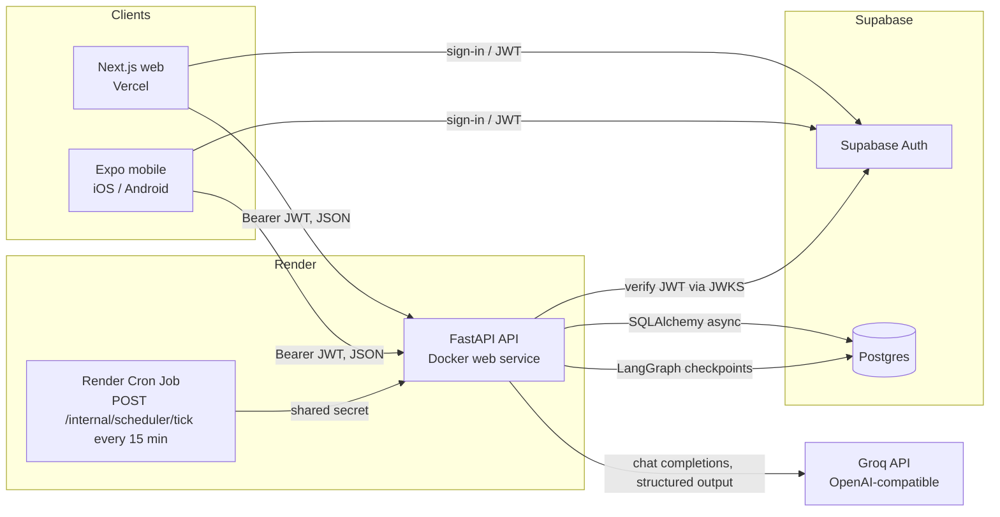
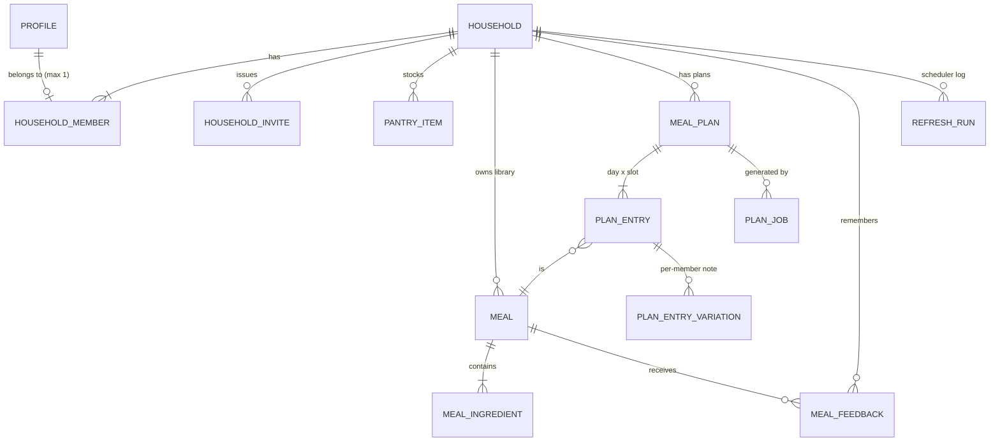
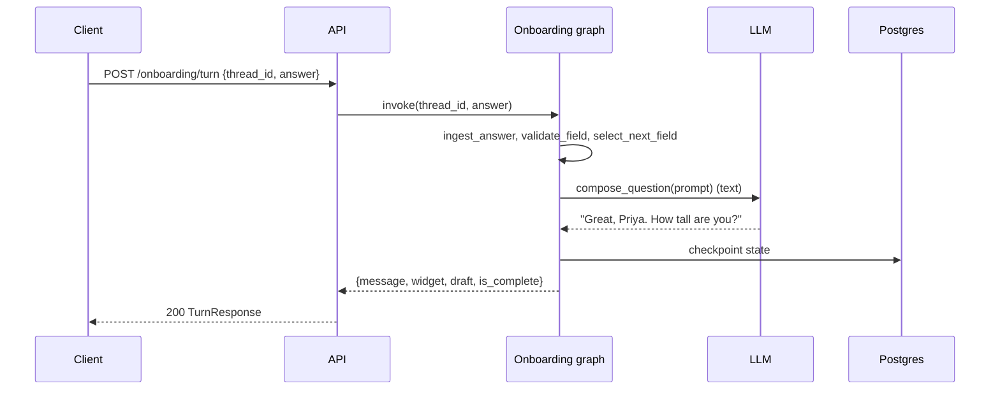
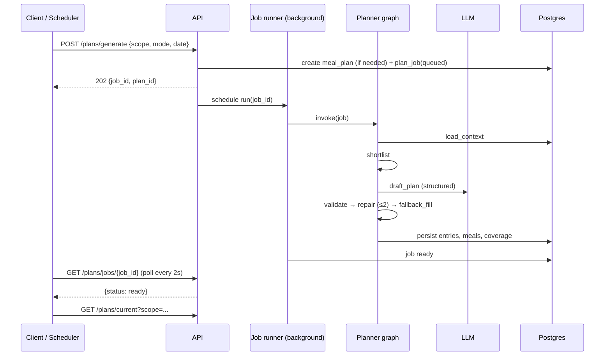

# Larder — High-Level Design (HLD)

**Status:** Approved design, 2026-09-18
**Companion documents:** `docs/LLD.md` (contracts, schema, agents, screens), `docs/IMPLEMENTATION_PLAN.md` (ordered build tasks), `docs/Requirements.md` (original brief)

---

## 1. Product summary

Larder is an agentic meal planner for individuals and families. Its defining idea is **pantry-first, zero-waste planning**: the planner starts from what is actually in the kitchen, builds a plan that uses those items up, explains why each meal was chosen ("uses the spinach and paneer you already have"), and only then produces a short top-up shopping list. Families get one shared menu that honours every member's hard constraints, rotates favourites fairly, and carries per-member notes ("no chilli for Aarav").

Larder is deliberately **not** a calorie tracker, recipe search engine, or grocery delivery app. Quantities are out of scope by requirement; the pantry records *what* is present, not *how much*.

### 1.1 Goals (from requirements, refined)

| # | Goal | How Larder meets it |
|---|------|---------------------|
| G1 | LLM-driven profile creation on first sign-up: biological details, dietary preferences, medical history | Onboarding agent: hybrid chat with typed inline widgets, review card, saved as a structured profile |
| G2 | Family groups where existing users can be added | Households with an invite code; one shared pantry; owner and member roles |
| G3 | Record every food item at home, category-wise | Pantry with a fixed category set (spices, grains, pulses, vegetables, fruits, dairy, proteins, …) and an LLM-backed categoriser for free-text entry |
| G4 | Daily and weekly meal plans from view (single/family), preferences, and kitchen stock; no quantities | Planner agent: context → shortlist → LLM draft → hard-constraint validator → repair → persist. Runs in week, today, and single-slot modes |
| G5 | Plans refresh on a pre-defined cadence | Household-configurable weekly refresh (day + time) and daily refresh (time). A scheduler tick regenerates only when planner inputs changed |
| G6 | Users add meals that feed future suggestions | Private household meal library; LLM enrichment (ingredients, tags, allergens, prep time); planner prefers library meals |
| G7 | Web and React Native mobile | Next.js web app and Expo mobile app in one monorepo, sharing an API client and design tokens |
| G8 | Groq as the LLM; key added after development | Provider abstraction with a Groq implementation and a deterministic fake. The whole app runs and tests without a key |
| G9 | Modern, simple, distinctive look; light and dark themes | Explicit design tokens and layout rules (see LLD §9) so the coding model does not default to a generic look |
| G10 | Public deployment on Vercel / Render | Web on Vercel, API + cron on Render, database and auth on Supabase |

### 1.2 v1 feature list

Core: sign-up/sign-in (email + password), onboarding agent, profile editing, households and invite codes, pantry, meal library with enrichment, weekly and daily plans (single and family view), scheduled refresh, per-meal reasons, per-member variations.

Extras included in v1: swap one meal slot with a reason; shopping list derived from plan minus pantry; thumbs up/down and "I cooked this" feedback that becomes household memory; "unused this week" hint listing pantry items no planned meal touches.

### 1.3 Non-goals (v1)

- Quantities, expiry dates, nutrition or calorie totals
- Photo-based pantry capture (future; a vision-capable Groq model such as Llama 4)
- Public or community recipe sharing
- Push notifications, email delivery, Google/Apple sign-in
- Multiple households per user; personal pantries separate from the household pantry
- Medical-grade advice or regulatory compliance (see §8.3)

---

## 2. Users and key journeys

**Actors:** a *user* (authenticated person), a *household* (one or more users sharing a kitchen; solo users get an implicit household), the *owner* (creator of a household), the *scheduler* (system actor).

### 2.1 First-run journey

1. Sign up with email + password (Supabase Auth).
2. Onboarding agent asks one question at a time with an inline widget; a review card is confirmed; profile saved; implicit household created.
3. Pantry setup screen: bulk-add items ("paneer, spinach, basmati rice, toor dal…"); categories auto-assigned; user may skip.
4. Redirect to Today. A week plan is generated in the background; the screen shows progress, then today's meals with reasons and a pantry coverage summary.

### 2.2 Everyday journey

- Open Today: see meals per slot, why each was picked, which ingredients are on hand, which are missing. Swap a slot ("too heavy", "no time"). Mark thumbs up/down or "I cooked this".
- Open Week: the 7-day grid; regenerate the week on demand.
- Update the pantry when shopping or running out. The next daily refresh notices the change (inputs hash differs) and regenerates today's meals.
- Add a family recipe to the meal library; the enrichment call fills in ingredients and tags; the planner starts suggesting it.
- Open Shopping: ingredients the remaining plan needs that the pantry lacks, grouped by category.

### 2.3 Family journey

- Owner shares an 8-character invite code. A member enters it under Household → Join. Joining moves them out of their implicit solo household.
- Each member chooses a preferred view: *family* (the shared household plan) or *single* (a personal plan from the same pantry but only their own profile).
- The family plan enforces the union of all members' allergens and medical restrictions and the strictest diet type as hard constraints; likes and dislikes are soft and rotated so nobody's favourites dominate.

---

## 3. System architecture

### 3.1 Overview diagram

### 3.2 Components

| Component | Technology | Responsibility |
|-----------|------------|----------------|
| Web app | Next.js (App Router), React, TypeScript, Tailwind CSS v4, TanStack Query, `@supabase/ssr` | Authenticated UI for all features; deployed on Vercel |
| Mobile app | Expo (latest stable SDK), Expo Router, React Native, TypeScript, TanStack Query, `@supabase/supabase-js` with SecureStore | Same features as web with native navigation; distributed via Expo Go / EAS builds |
| API | Python 3.12, FastAPI, SQLAlchemy 2 (async, asyncpg), Alembic, Pydantic v2, LangGraph, langchain-groq | Single business-logic boundary: auth verification, households, pantry, meals, plans, agents, scheduler endpoint |
| Agents | LangGraph graphs inside the API process | Onboarding (stateful, checkpointed), Planner (week/today/slot), Enrichment and Categoriser (single structured calls) |
| LLM provider | `LLM` protocol with `GroqLLM` and `FakeLLM` implementations | Text and structured completions; Groq via `https://api.groq.com/openai/v1`; fake for dev and tests |
| Database | Supabase Postgres | All application tables, Alembic-managed; LangGraph checkpoint tables for onboarding threads |
| Auth | Supabase Auth (email + password) | Identity, sessions, password reset; API trusts Supabase JWTs |
| Scheduler | Render Cron Job → `POST /internal/scheduler/tick` | Triggers weekly and daily refresh evaluation; idempotent |
| Shared packages | `packages/api-client` (generated OpenAPI types + fetch client + TanStack Query hooks), `packages/design-tokens` | Keep both clients consistent with the API and with each other |

### 3.3 Key architectural decisions

| Decision | Choice | Rationale |
|----------|--------|-----------|
| Where business logic lives | Only in FastAPI. Clients never read or write Supabase tables directly | One place for rules, validation, and agent orchestration; Row Level Security is not relied on |
| Auth | Supabase Auth issues JWTs; API verifies via JWKS (ES256/RS256) with optional HS256 legacy secret | No custom auth code; both clients use the official SDKs |
| Profile provisioning | Just-in-time: first authenticated API call creates the `profiles` row from the JWT `sub` and `email` | No webhook or trigger dependency on Supabase internals |
| Agent framework | LangGraph with deterministic control flow; the LLM writes language and drafts, code decides sequencing and validity | Testable with a fake LLM; predictable behaviour; checkpointing for onboarding resumability |
| Structured output | Pydantic schemas passed to the LLM as JSON Schema (`response_format`/tool calling) | Groq's OpenAI-compatible API supports it; validation happens in code regardless |
| Background work | FastAPI background tasks in-process; job rows in `plan_jobs` track status | Sufficient for a single Render instance; upgrade path to a queue is isolated in `jobs/runner.py` |
| Cadence | Cron tick every 15 minutes; API decides what is due per household timezone; refresh runs are recorded for idempotency | No long-lived scheduler process; safe against duplicate ticks |
| Quantities | Never stored; coverage is ingredient-name matching | Required simplification; keeps the pantry effortless |
| Meal identity | Every planned meal references a `meals` row; planner-generated meals are stored with `source = generated` | Feedback, history and variety checks all key off `meal_id` |
| Shopping list | Derived at read time from plan entries minus pantry | No sync problems; always current |

---

## 4. Domain model (conceptual)

- **Profile** — one per user; biological details, diet type, cuisines, allergens, likes, dislikes, medical conditions, goals, cooking skill, max prep time, onboarding status.
- **Household** — name, owner, timezone, meal slots (configurable, default Breakfast/Lunch/Snack/Dinner), weekly refresh day and time, daily refresh time, `is_implicit` flag for auto-created solo households.
- **Household member** — role (owner/member), preferred view (single/family).
- **Pantry item** — name, normalised name, category, availability flag.
- **Meal** — household-scoped; source user or generated; enriched tags; ingredients with category, staple and optional flags.
- **Meal plan** — household, scope (family or single + member), 7-day range, status; **plan entries** per date and slot with a reason, pantry coverage and missing ingredients; **variations** per member.
- **Plan job** — mode (week/today/slot), target, status, inputs hash, error.
- **Feedback** — up/down/cooked/skipped per member per meal, optional comment.
- **Refresh run** — scheduler idempotency log per household, kind and period.

Exact columns, types, indexes and constraints are in LLD §3.

---

## 5. Agent designs

All agents receive the `LLM` provider through LangGraph's `configurable` so tests inject `FakeLLM`. Control flow is code; the LLM produces language or a structured draft that code then validates.

### 5.1 Onboarding agent

- **Purpose:** collect a complete profile through a friendly one-question-at-a-time conversation with typed widgets.
- **State:** thread id, user id, partial `ProfileDraft`, ordered list of required fields, the field currently being asked, short message history, `is_complete`.
- **Flow per turn:** `ingest_answer` (structured widget answers are applied directly; free-text answers are parsed by the LLM into the field's type) → `validate_field` → `select_next_field` (first missing required field; `medical_notes` only if conditions were given) → `compose_question` (LLM writes one warm sentence referencing earlier answers; widget spec comes from a static field-to-widget map) → wait. When no field remains → `summarize` (review card) → complete.
- **Persistence:** LangGraph Postgres checkpointer keyed by thread id, so the conversation resumes across devices and app restarts.
- **Output:** `POST /onboarding/complete` writes the profile, creates the implicit household and enqueues the first week plan.

### 5.2 Planner agent

- **Purpose:** produce or repair a plan for a household scope in one of three modes: `week` (7 days from a start date), `today` (all slots for one date, other days fixed), `slot` (one entry, with a user-supplied reason).
- **Nodes:**
  1. `load_context` — member profiles in scope, available pantry items, library meals with ingredients, feedback aggregates per meal, meals used in the last 14 days, household slots, fixed entries (today/slot modes).
  2. `shortlist` — deterministic scoring of library meals by pantry coverage, feedback and recency; hard-constraint filter; top 40 candidates.
  3. `draft_plan` — LLM structured output: entries with either an existing meal id or a fully specified new meal, a one-sentence reason, and per-member variations.
  4. `validate` — hard rules (slot completeness, allergens, medical restrictions, diet compatibility, repetition limit) produce violations; soft rules (dislikes, prep time, coverage) produce warnings.
  5. `repair` — LLM receives the violations and returns a corrected draft; at most two attempts.
  6. `fallback_fill` — if still invalid, violating entries are replaced deterministically from the shortlist so a plan always completes.
  7. `persist` — upsert generated meals, write entries with coverage and missing ingredients, mark the job ready.
- **Why this shape:** the LLM never has the last word on safety-relevant constraints; the fallback guarantees a plan; the same graph serves scheduled and user-initiated runs.

### 5.3 Enrichment and categoriser

- **Meal enrichment:** one structured call turning a name plus optional description/ingredients/instructions into normalised ingredients (with category, staple and optional flags), cuisine, meal types, diet tags, allergens and prep minutes. Runs synchronously on meal creation; failure stores the meal with `enrichment_status = failed` and the raw ingredient list.
- **Pantry categoriser:** static keyword map first (fast, offline); unknown names go to one batched structured LLM call; anything still unknown becomes `other`.

---

## 6. Core data flows

### 6.1 Onboarding turn

### 6.2 Plan generation (user-initiated or scheduled)

### 6.3 Scheduler tick

1. Render Cron calls `POST /internal/scheduler/tick` with the shared secret every 15 minutes.
2. For each household, compute local time in its timezone.
3. **Weekly:** if local weekday equals `weekly_refresh_day`, local time ≥ `weekly_refresh_time`, and no `refresh_runs` row exists for (household, weekly, this period), enqueue a week plan starting tomorrow for every active scope, then record the run.
4. **Daily** (evaluated after the weekly step): if local time ≥ `daily_refresh_time` and no daily run today: compute the planner inputs hash; if the current plan's last successful job hash differs, enqueue a `today` job; if no current plan exists, enqueue a `week` job for a gap-fill plan that starts today and ends the day before the next scheduled plan begins (or seven days out when none exists), so it never supersedes a plan the weekly step just created. Record the run.
5. Active scopes per household: the family scope when member count > 1 and any member prefers family; a single scope for each member who prefers single (a solo household has exactly one single scope).

### 6.4 Shopping list

`GET /plans/{plan_id}/shopping-list` unions `missing_ingredients` of entries from today to the plan end, drops staples and optional ingredients, dedupes by normalised name, groups by category, and lists which meals need each ingredient.

---

## 7. Cross-cutting concerns

### 7.1 Configuration

All configuration is via environment variables validated at start-up (LLD §2.4). `LLM_PROVIDER=fake` is the default when `GROQ_API_KEY` is absent, so a fresh clone runs end to end.

### 7.2 Error handling

- API errors use one envelope: `{"error": {"code", "message", "details"}}` with stable codes (`unauthorized`, `forbidden`, `not_found`, `validation_error`, `conflict`, `job_running`, `llm_unavailable`).
- LLM calls have a 60-second timeout and one retry on transient errors; structured-output parse failures count as a repair attempt in the planner and as `enrichment_status = failed` for meals.
- Plan jobs never leave the plan in a half-written state: entries are written in one transaction at `persist`.
- Clients show inline, specific messages ("Couldn't reach the planner. Your previous plan is still here.") rather than generic toasts.

### 7.3 Observability

- Structured JSON logs (request id, user id, household id, job id, LLM latency and token usage when available).
- `GET /health` reports database connectivity and the configured LLM provider.
- Plan jobs store `model_name`, timings and error text for inspection.

### 7.4 Performance targets (POC)

| Operation | Target |
|-----------|--------|
| Ordinary API request | < 300 ms p95 (excluding LLM calls) |
| Onboarding turn | < 4 s |
| Meal enrichment | < 8 s |
| Week plan job | < 60 s end to end, including up to two repairs |
| Scheduler tick | < 30 s for 100 households (enqueues only) |

---

## 8. Security and privacy

### 8.1 Authentication and authorisation

- Every non-internal endpoint requires a valid Supabase JWT (`aud = authenticated`); the API resolves the caller's profile and household on each request.
- Authorisation is household-scoped: a user can read and write only their household's pantry, meals, plans and feedback. Owner-only actions: invites, removing members, editing household settings.
- Internal scheduler endpoint requires the `X-Scheduler-Secret` header; it is not reachable through the public clients.

### 8.2 Data protection

- Secrets live only in Vercel/Render/Supabase environment settings; `.env.example` documents names without values.
- The API uses a direct database role; no service keys are shipped to clients. Clients hold only the Supabase publishable (anon) key, which cannot read tables because the API is the only consumer and RLS remains enabled with no permissive policies.
- CORS restricted to the web origin(s); mobile calls are not subject to CORS.

### 8.3 Medical data

Larder stores medical conditions and notes to shape meal suggestions. Data is encrypted at rest by Supabase and only surfaced to the owning user and their household planner. This is a proof of concept: it makes no HIPAA, GDPR-Article-9 or medical-device claims, and the UI states that suggestions are not medical advice. Users can clear medical fields at any time from Profile.

---

## 9. Deployment

| Piece | Where | Notes |
|-------|-------|-------|
| Web | Vercel, root `apps/web`, framework Next.js | Env: `NEXT_PUBLIC_SUPABASE_URL`, `NEXT_PUBLIC_SUPABASE_ANON_KEY`, `NEXT_PUBLIC_API_URL` |
| API | Render Web Service from `apps/api/Dockerfile` | Env: `DATABASE_URL` (Supabase session pooler URL), `SUPABASE_URL`, `GROQ_API_KEY`, `GROQ_MODEL`, `LLM_PROVIDER`, `SCHEDULER_SECRET`, `CORS_ORIGINS`; runs `alembic upgrade head` on start |
| Scheduler | Render Cron Job, schedule `*/15 * * * *` | Command: `curl -fsS -X POST "$API_URL/internal/scheduler/tick" -H "X-Scheduler-Secret: $SCHEDULER_SECRET"` |
| Database + Auth | Supabase project | Email + password provider enabled; email confirmation optional for POC |
| Mobile | Expo Go during development; EAS build for installable binaries | Env: `EXPO_PUBLIC_*` equivalents |

Infrastructure as code: `render.yaml` at the repo root describes the API service and cron job; Vercel is configured through the dashboard with the monorepo root directory set to `apps/web`.

---

## 10. Testing strategy (summary)

| Layer | Tooling | What is covered |
|-------|---------|-----------------|
| API unit | pytest | normalisation, hashing, shortlist scoring, validator rules, diet matrix, fallback fill, categoriser map, onboarding field sequencing, shopping derivation |
| Agent | pytest + `FakeLLM` | full onboarding conversation; planner in all three modes including repair and fallback paths |
| API integration | pytest + httpx + Postgres (Docker or Supabase local) | every router, auth and authorisation rules, scheduler tick idempotency |
| Web unit | Vitest + React Testing Library | widget renderer, plan views, pantry bulk add, theme switching |
| Web e2e | Playwright against local API with `LLM_PROVIDER=fake` | sign-up → onboarding → pantry setup → today plan → swap → feedback |
| Mobile | jest-expo | widget renderer and Today screen components |

Details, fixtures and commands are in LLD §10 and each task of the implementation plan.

---

## 11. Risks and mitigations

| Risk | Mitigation |
|------|------------|
| Groq model structured output drifts or fails | Pydantic validation, repair loop, deterministic fallback fill; model name configurable; tool-calling fallback for models without JSON-schema mode |
| Groq free-tier rate limits (tokens and requests per minute) | Compact prompts (shortlist capped at 40, names not full recipes); one retry honouring `retry-after`; jobs fail cleanly with a Retry action rather than looping |
| Long plan jobs on free-tier Render | Background execution with polling; 60 s target; plan persisted atomically |
| Supabase pooler / IPv6 issues from Render | Use the Supabase *session pooler* URL (IPv4) for both SQLAlchemy and the LangGraph checkpointer |
| Duplicate scheduler ticks | `refresh_runs` uniqueness per household, kind and period |
| Generic-looking UI | Design tokens and layout rules are prescriptive (LLD §9); reviewers check against them |
| Ingredient name matching is fuzzy | Normalisation + token containment; unmatched items simply appear on the shopping list, never break the plan |

---

## 12. Future work

Photo pantry capture (a vision-capable Groq model such as Llama 4), Google/Apple sign-in, push notifications when a plan refreshes, expiry-aware "use it first" ordering, batch-cook and leftovers planning, a public recipe library with moderation, a queue-backed job runner (arq/Redis) for multi-instance API deployments.
